

# DOTS Battle Simulator Prototype

### Высокопроизводительный боевой симулятор-прототип на Unity 6 DOTS с собственным `Data-Oriented Behaviour Tree framework`, кастомным Vertex Animation Texture pipeline и модульной архитектурой, ориентированной на production-подход.

  
  
  
  
  
  
  
  
  
  
  
  

  <strong>Unity DOTS Portfolio Project</strong> ·
  <strong>Engineering Showcase</strong> ·
  <strong>Technical Battle Sandbox</strong>

## Кратко о проекте

> **DOTS Battle Simulator Prototype** — это не учебный проект и не готовая игра, а **инженерная витрина**, построенная вокруг задачи масштабируемой симуляции и рендера более 10K боевых юнитов в современном стеке `Unity DOTS`.

💡 **Главная ценность проекта — не в количестве контента, а в качестве технического основания:**
- собственный **`Data-Oriented Behaviour Tree framework`**;
- собственный DOTS-friendly **VAT animation pipeline** с `baker/runtime/shader`-частью;
- полный контроль над **жизненным циклом ECS-систем**;
- слоистая **архитектура приложения** на `VContainer`;
- понятное разделение **Bootstrap / Meta / Gameplay**;
- набор gameplay-, UI-, save- и editor-систем, собранных как расширяемая кодовая база.

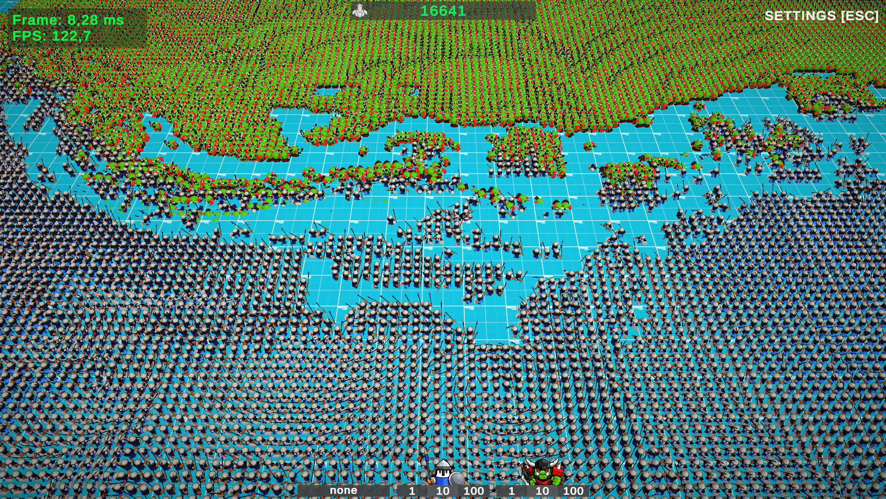

---

## Содержание

- [Архитектурная карта](#архитектурная-карта)
  - [Структура проекта](#структура-проекта)
  - [Naming и навигация по коду](#naming-и-навигация-по-коду)
  - [Постоянная Bootstrap сцена](#постоянная-bootstrap-сцена)
  - [Game State Machine](#game-state-machine)
  - [Полный контроль над ECS-lifecycle](#полный-контроль-над-ecs-lifecycle)
  - [Pipeline запуска: от Bootstrap до Gameplay](#pipeline-запуска-от-bootstrap-до-gameplay)
- [Custom Behaviour Tree for DOTS](#custom-behaviour-tree-for-dots)
  - [Почему в проекте используется собственный BT](#почему-в-проекте-используется-собственный-bt)
  - [Редактор графов в ООП и компиляция в runtime-asset](#редактор-графов-в-ооп-и-компиляция-в-runtime-asset)
  - [Runtime-модель и причина итеративной реализации](#runtime-модель-и-причина-итеративной-реализации)
  - [Кодогенерация](#кодогенерация)
  - [Дебаг и отладка](#дебаг-и-отладка)
- [Custom VAT animation pipeline](#custom-vat-animation-pipeline)
  - [Зачем VAT используется в этом проекте](#зачем-vat-используется-в-этом-проекте)
  - [Почему собственная реализация здесь оправдана](#почему-собственная-реализация-здесь-оправдана)
- [Дополнительные стратегические решения](#дополнительные-стратегические-решения)
  - [Battlefield Grid](#battlefield-grid)
  - [Eye Sensor Grid](#eye-sensor-grid)
  - [Единое окно геймдизайнера](#единое-окно-геймдизайнера)
  - [Подход к реализации UI в проекте](#подход-к-реализации-ui-в-проекте)
  - [Модуль сохранений](#модуль-сохранений)
- [Запуск проекта](#запуск-проекта)

---

  
## Архитектурная карта

### Структура проекта

Ключевые слои в проекте организованы в отдельных папках по **смыслу, области ответственности и lifetime**.

| Слой                      | Назначение                                                                                                                                                                                                                                   |
|---------------------------|----------------------------------------------------------------------------------------------------------------------------------------------------------------------------------------------------------------------------------------------|
| `Core`                    | Фундамент проекта. Абстракции, жизненные интерфейсы, типизированные идентификаторы. Словарь и конституция проекта.                                                                                                                           |
| `Infrastructure`          | Технический позвоночник проекта. Не правила игры, а сервисы которые делают игру возможной как приложение. Мост между “чистой архитектурой проекта” и “реальностью Unity”.                                                                    |
| `GameApp`                 | Дирижер всего проекта. Слой, который решает как и в каком порядке игровой мир должен быть поднят, какие сцены загрузить, какие контексты прогреть, как упаковать это в управляемый runtime. Точка входа в приложение.                        |
| `Gameplay`                | Сердце самого геймплея. Правила игрового мира. Игровые механики.                                                                                                                                                                             |
| `Global`                  | Слой сервисов, фич, “структурных механик”, общих для всего проекта.                                                                                                                                                                          |
| `Local`                   | Слой локального контекста конкретной сцены или состояния. Набор сервисов которые нужны здесь и сейчас внутри активного контекста.                                                                                                            |
| `Tools`                   | Служебный слой для разработки, отладки и удобства работы с проектом.                                                                                                                                                                         |
| `Assets/VadimBurym-DODBT` | Самостоятельный BT-модуль: runtime, editor, tests. Модифицированная версия раннее разработанного мною плагина `DODBT` специально под `DOTS` с поддержкой `Burst`, `Jobs` и `BlobAsset`. Пригоден для внедрения в любой другой `DOTS`-проект. |

### Naming и навигация по коду

| &nbsp;&nbsp;&nbsp;&nbsp;&nbsp;&nbsp;&nbsp;&nbsp;&nbsp;&nbsp;Имя&nbsp;&nbsp;&nbsp;&nbsp;&nbsp;&nbsp;&nbsp;&nbsp;&nbsp;      | Назначение                                                                                                                                                                                  |
|----------------------------------------------------------------------------------------------------------------------------|---------------------------------------------------------------------------------------------------------------------------------------------------------------------------------------------|
| `System`                                                                 | Исполнитель и орекстратор. Не хранилище и не модель данных, а место где что-то происходит. Соединяет данные, сервисы, провайдеры, ввод или  ECS-компоненты и заставляет их работать вместе. |
| `Service`                                                                | Долгоживущая логика и состояние. Объект который что-то обслуживает и предоставляет API.                                                                                                     |
| `Provider`                                                               | То же что и Service, только обслуживает объект существующий в мире, на сцене или вне кода, адаптер к миру Unity.                                                                            |
| `Factory`                                                                | Создание и сборка сущностей или объектов.                                                                                                                                                   |
| `Domain`                                                                 | Внутреннее ядро и модель модуля. Сущности и правила в OOP-части проекта.                                                                                                                    |
| `Components`                                                             | Слой данных в ECS-части проекта.                                                                                                                                                            |
| `UI`                                                                     | Слой представления в паттерне MVP Presentation-Model (Близкий по идеологии к MVVM).                                                                                                         |
| `StaticData`                                                             | Статические данные, конфиги, которые настраивает геймдизайнер и которые лежат в основе всего игрового процесса.                                                                             |

### Постоянная Bootstrap сцена

Архитектура проекта построена вокруг постоянной `Bootstrap`-сцены, которая загружается первой и остаётся активной на протяжении всей жизни приложения. Все прикладные сцены — `meta`, `gameplay` и любые другие режимы — подключаются аддитивно поверх Bootstrap, а затем выгружаются без разрушения базового окружения.

Такой подход решает ту же базовую задачу, что и `DontDestroyOnLoad`, но делает это на более управляемом архитектурном уровне: вместо набора отдельных “неуничтожаемых” объектов проект получает единый постоянный `composition root`, вокруг которого выстраивается весь `runtime lifecycle`.

🧱 **В `Bootstrap`-сцене сосредоточены элементы, которые должны существовать непрерывно и не зависеть от смены игровых режимов:**
- `Bootstrap Context` / корневой `DI`-контейнер;
- инфраструктурные сервисы приложения;
- `GameStateMachine`, управляющая переходами между состояниями;
- глобальные фичи и системы, необходимые в течение всей сессии;
- общие `MonoBehaviour`-объекты, используемые во всех режимах;
- единственная основная камера;
- общий `UI`-слой, включая экран загрузки и системные оверлеи;
- глобальный аудио-контур;
- общий `Volume profile`;
- общие `DOTS` / ECS subscene baked entities, которые должны быть доступны на протяжении всей игры.

✅ **Это решение позволяет:**
- не терять звук при переключении сцен, поскольку аудио-контур не пересоздаётся;
- использовать одну камеру на весь проект, а в прикладных сценах определять только точку входа и `scene-specific` позиционирование;
- однократно конфигурировать общие объекты, не размножая их настройки по отдельным сценам;
- централизовать глобальные зависимости, вместо того чтобы собирать их заново при каждом переходе;
- изолировать `scene-local content` от `persistent infrastructure`, что упрощает загрузку, выгрузку и дальнейшее расширение проекта.

> По сути, `Bootstrap`-сцена выступает как постоянный `runtime-root` приложения.
Именно в ней закрепляется всё, что должно переживать смену игровых состояний, а сами `gameplay`-сцены становятся сменяемыми модулями контента, которые можно безопасно подгружать и выгружать поверх стабильной основы.

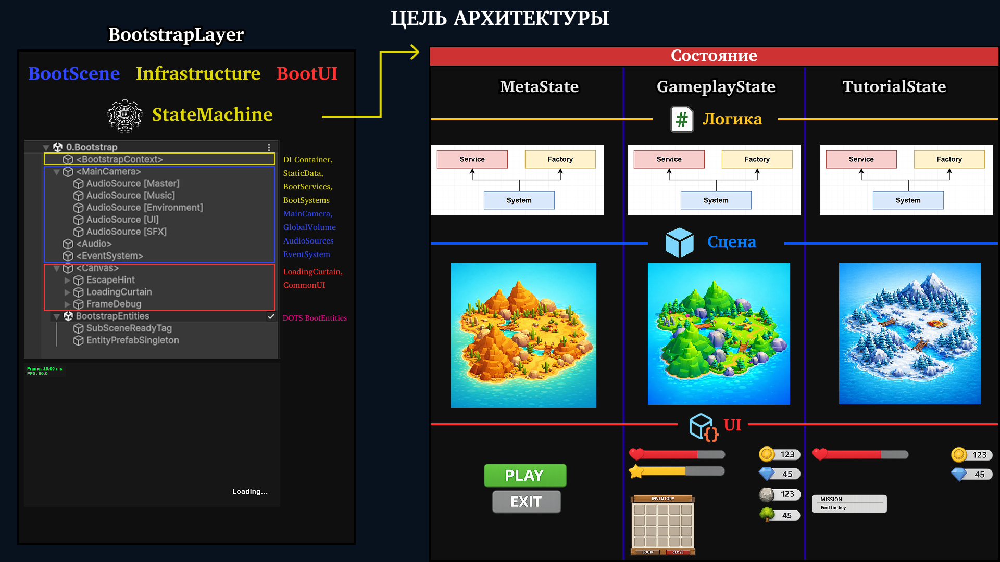

### Game State Machine

Верхнеуровневая `orchestration`-логика приложения собрана вокруг `StateMachine`, которая выступает как единая точка управления жизненным циклом игровых состояний.
Именно через неё приложение переходит между режимами, а каждая смена состояния превращается не просто в загрузку другой сцены, а в последовательную сборку нового `runtime`-контекста.

`StateMachine` является одним из центральных механизмов слоя `GameApp`.
Она отвечает не за локальную игровую логику, а за дирижирование приложением как системой: определяет, какое состояние должно быть активным, и обеспечивает полный `lifecycle` этого состояния — от входа до выхода.

⚙️ **Для каждого состояния задаётся собственный сценарий входа, и `StateMachine` последовательно поднимает всё, что требуется именно этому режиму:**
- загружает нужные `Addressables`;
- подключает соответствующую сцену;
- создаёт локальный `context` для текущего состояния;
- инициализирует специфичную для этого состояния логику;
- поднимает необходимый `UI`;
- включает нужные `DOTS` / ECS systems;
- передаёт управление в lifecycle текущего `state object`.

🔄 **Каждое состояние в этой модели существует как полноценный `lifecycle`-объект со своей фазовой жизнью:**
- `Enter` — подготовка и активация состояния;
- `Tick` — его основная рабочая фаза;
- `Exit` — корректное завершение и освобождение ресурсов.

> Иными словами, `StateMachine` в проекте выполняет роль `application conductor`: не реализует сам gameplay, но задаёт правильный порядок, в котором приложение поднимает нужный контент, активирует нужные системы и безопасно переключается между режимами.

### Полный контроль над ECS-lifecycle

Вся `ECS`-часть проекта построена на принципе явного управления жизненным циклом систем, без опоры на неявное `auto-creation` поведение.
Для этого все runtime-системы помечены `[DisableAutoCreation]`, а их подключение выполняется только через контролируемый `orchestration layer`.

Такой подход меняет саму модель работы с `DOTS`: `ECS` перестаёт быть “самозапускающейся средой”, в которой системы появляются по факту существования в сборке, и становится осознанно собираемым runtime-контекстом, который поднимается только тогда, когда это действительно нужно текущему состоянию приложения.

✅ **Это даёт несколько практических преимуществ:**
- жизненный цикл `ECS` совпадает с жизненным циклом конкретного `game state`;
- Meta и Gameplay не делят один неуправляемый набор систем;
- включение и выключение логики становится архитектурным действием, а не побочным эффектом загрузки сцены;
- проще контролировать зависимости между `DI`, сценой, `UI` и `ECS` runtime;
- проще масштабировать проект без накопления “всегда живых” систем.

Для подключения `ECS`-логики используется отдельный кастомный `builder`, который регистрирует системы в нужную локальную `ECS group`.

При этом регистрация поддерживает оба основных сценария:

- `unmanaged` ISystem — для производительных `Burst-friendly` систем без `managed`-состояния;
- `managed` SystemBase — для случаев, где необходимы managed-зависимости и более тесная интеграция с инфраструктурным слоем. Здесь также дополнительно поддерживается инъекция зависимостей через поля, помеченные `[Inject]`;

Это позволяет использовать managed ECS-системы как полноценные участники общей архитектуры проекта, а не как изолированные Unity-объекты, которым приходится вручную искать зависимости через `singleton`’ы, `service locator` или глобальные ссылки.

Отдельного внимания заслуживает работа с `baked entity prefabs`.
В проекте для них выделена специальная система загрузки и выгрузки, поскольку такие сущности не подчиняются тому же pipeline, что и обычные `Addressable`-ресурсы, и требуют использования отдельного API.

Это важное инженерное решение: `baked entity prefabs` не смешиваются с обычной `asset-loading` логикой, а обслуживаются специализированным слоем, который учитывает специфику `DOTS` content pipeline.

Именно эта подсистема размещена в **`Bootstrap SubScene`**, то есть на уровне постоянной инфраструктуры приложения.

В итоге `ECS` в проекте существует не как “встроенная магия Unity DOTS”, а как полностью подконтрольная часть `application lifecycle`.

📌 **Системы:**
- не создаются автоматически;
- не живут дольше, чем требуется состоянию;
- не запускаются раньше готовности зависимостей;
- не смешиваются бесконтрольно между разными режимами;
- могут использовать как чистый unmanaged путь, так и `managed integration` через `DI`.

А наличие отдельного слоя для `baked entity prefabs` дополняет эту модель:
контроль распространяется не только на `update systems`, но и на `ECS`-контент как на самостоятельную форму ресурсов.

### Pipeline запуска: от Bootstrap до Gameplay

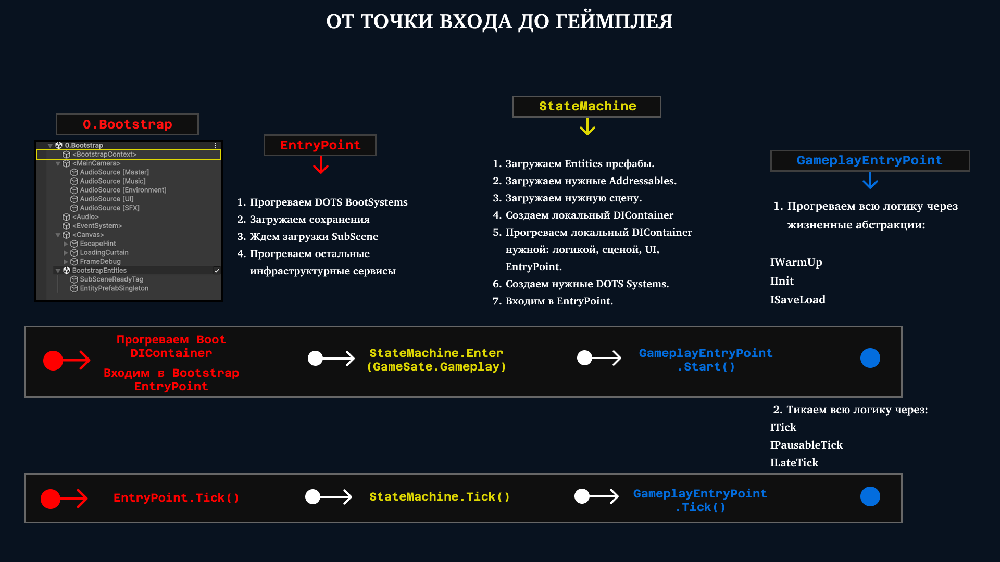

---

## Custom Behaviour Tree for DOTS

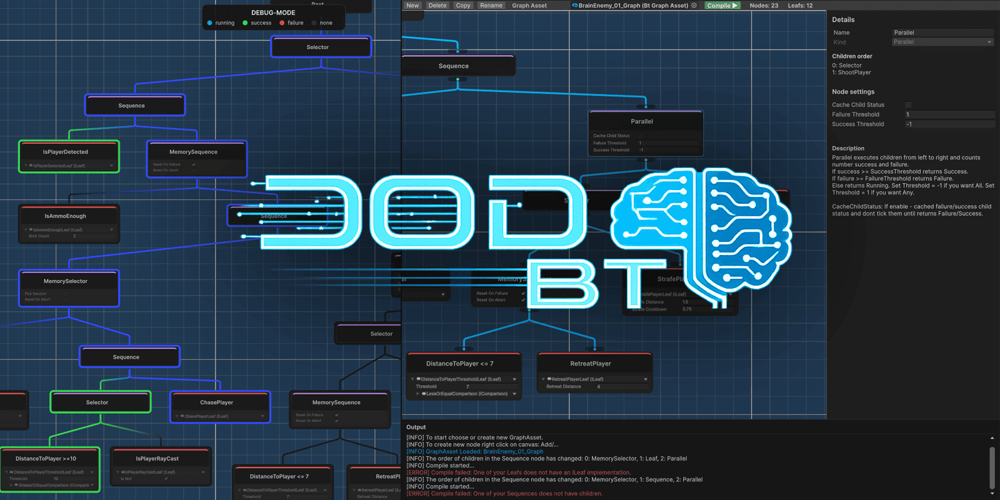

### Почему в проекте используется собственный BT

Решение о разработке собственного `Behaviour Tree framework` принято не из стремления “написать своё ради своего”, а как ответ на вполне конкретные ограничения существующих решений.

Большинство доступных BT-систем в той или иной степени закрывают отдельные сценарии, но редко совмещают весь необходимый набор свойств в одной архитектуре. Часть решений построена вокруг `MonoBehaviour`-подхода и плохо сочетается с `data-oriented runtime`. Часть предоставляет базовую функциональность дерева, но не даёт удобного графового `authoring` для геймдизайнера. У некоторых систем отсутствует полноценный `debug`-режим, из-за чего сложная AI-логика становится трудной для сопровождения. И самое важное — не найдено в открытом доступе ни одного решения, которое одновременно:
- дает полноценный визуальный редактор;
- удобно для разработчика при интеграции и расширении;
- имеет встроенный и обязательный `debug flow`;
- совместимо с `DOTS`, `ECS`, `Burst`, `Jobs`;
- ориентировано на массовое исполнение и предсказуемое поведение под высокой нагрузкой.

Поэтому собственный `Behaviour Tree` преследует следующие цели:

- 🎨 Визуальный графовый редактор для `authoring` без контакта с кодом
- ⚡ `Data-oriented runtime` совместимый с `DOTS`: Архитектура, своместимая с `ECS`, итеративная реализация совместимая с `Burst` и `Jobs`, оптимизация по памяти с поддержкой `BlobAsset`
- 🧩 Удобная и расширяемая интеграция для разработчика с использованием кодогенерации
- 🐞 Понятный режим дебага и красивой отладки
- 🔨 BT - самостоятельный слой принятия решений, не зависящий от игровой логики: можно обновлять раз в N секунд.

### Редактор графов в ООП и компиляция в runtime-asset

Графовая часть `Behaviour Tree` в проекте намеренно реализована в `OOP`-модели, а `runtime`-исполнение опирается уже на скомпилированный плоский `asset`.
Это разделение продиктовано не стилистическими предпочтениями, а различием между двумя принципиально разными задачами:

- человеку удобно работать с графом как с набором связанных объектов;
- машине удобнее исполнять компактные, линейные и предсказуемо организованные данные.

Именно поэтому `authoring` и `runtime` в проекте не совмещаются в одной и той же структуре.

🧠 **Здесь важны не столько плотность данных и `cache-friendly layout`, сколько удобство взаимодействия:**
- создавать ноды и связи между ними;
- перетаскивать узлы по полотну;
- изменять имена;
- визуально читать структуру дерева;
- проверять порядок дочерних узлов;
- настраивать параметры в привычной редакторной форме;
- связывать leaf-логику с игровой логикой без необходимости работать с runtime-представлением напрямую.

Для таких задач объектная модель подходит естественно:
нода может хранить ссылки на детей, редакторные метаданные, позицию на `canvas`, пользовательское имя, служебные поля и всё, что важно именно для `authoring workflow`.

Иными словами, `OOP`-граф здесь нужен не для `runtime`, а для удобства производства контента.

То, что удобно человеку, почти никогда не является оптимальной формой для исполнения.
Для `runtime` гораздо полезнее, чтобы дерево было представлено как можно более просто:

- без редакторного шума;
- без лишних ссылочных объектов;
- без данных, нужных только для `UI` редактора;
- в форме, удобной для последовательного обхода и интеграции с ECS / `Burst-friendly execution model`.

Поэтому граф не исполняется напрямую.
Вместо этого он компилирует себя в отдельный плоский `runtime-asset`, который и используется в реальном выполнении дерева.

Такой подход даёт чёткое разделение ролей:

- `graph asset` отвечает за `authoring`;
- `compiled asset` отвечает за `runtime`.

Это позволяет не тащить `editor-oriented` модель в `hot path` и не заставлять runtime-подсистему расплачиваться за удобство редактора.

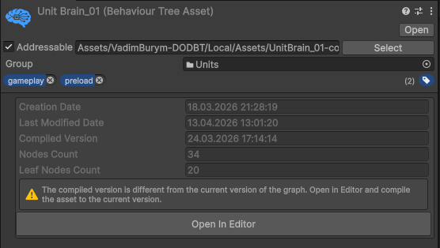

✨ **Что дает графовый редактор:**
- Визуальное создание и настройка нод без работы с кодом
- Быстрое изменение структуры дерева через связи и порядок дочерних узлов
- Переименование нод для читаемости и навигации
- Интеграция leaf-логики с игровой логикой прямо из редактора
- Подсказки по поведению composite-нод в текущей реализации
- Явная сверка порядка выполнения дочерних узлов
- Раннее обнаружение ошибок конфигурации до запуска `runtime`
- Предупреждения о некорректной настройке графа
- Логи компиляции и диагностика проблемных мест
- Уведомления об изменении порядка дочерних нод
- Компиляция editor-графа в плоский runtime-asset
- Отделение удобного `authoring`-представления от производительного `runtime`-представления

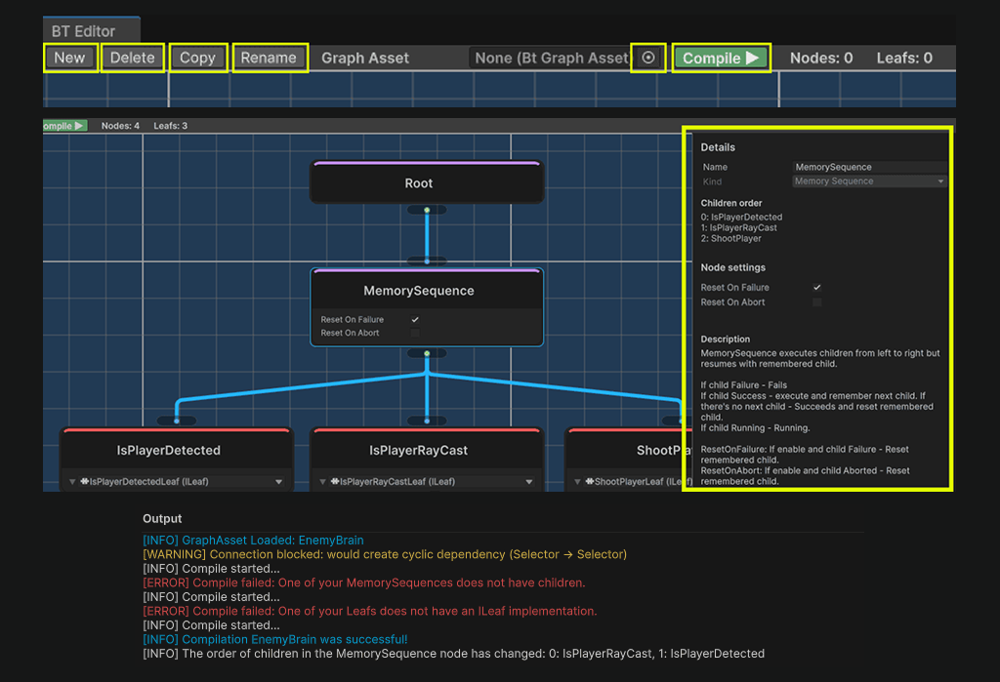

### Runtime-модель и причина итеративной реализации

`Runtime`-модель `Behaviour Tree` в проекте построена вокруг требований `data-oriented` дизайна.
**Для дерева принятия решений здесь важны не только выразительность и удобство `authoring`, но и то, насколько хорошо оно:**
- совместимо с `DOTS`;
- встраивается в `ECS`-flow;
- поддерживает распараллеливание;
- допускает `Burst`-компиляцию;
- остаётся предсказуемым по памяти при массовом количестве агентов.

Ссылочная структура из взаимосвязанных объектов плохо сочетается с требованиями `Burst` и с общим подходом `DOTS`, где предпочтение отдаётся компактным, линейным и явно управляемым данным.

Дополнительное ограничение накладывает сама модель исполнения.
Рекурсивный обход дерева удобен концептуально, но он плохо подходит для среды, в которой критичны:

- `Burst`-совместимость;
- контроль над памятью;
- предсказуемый `hot path`;
- работа внутри `Jobs`;
- массовое параллельное исполнение.

Иными словами, ни классическая OOP-реализация дерева, ни рекурсивный `runtime` физически не подходят для этой архитектуры.
Именно поэтому runtime BT собран как **итеративная** система с `program-counter` подходом.

⚙️ **Вместо вызовов “узел вызывает дочерний узел рекурсивно” дерево исполняется как явная `state machine`:**
- структура дерева хранится отдельно;
- состояние обхода хранится явно;
- переход между узлами идёт через индексы, курсоры и `cached state`;
- выполнение контролируется как последовательность шагов, а не как вложенность вызовов.

✅ **Это решение обеспечивает:**
- Совместимость с `Burst`-компиляцией
- Поддержка распараллеливания через `IJobChunk`
- Отдельное хранение состояния: одно дерево является общим для N агентов, у которых собственное runtime-состояние дерева
- Хорошая совместимость с `ECS` архитектурой

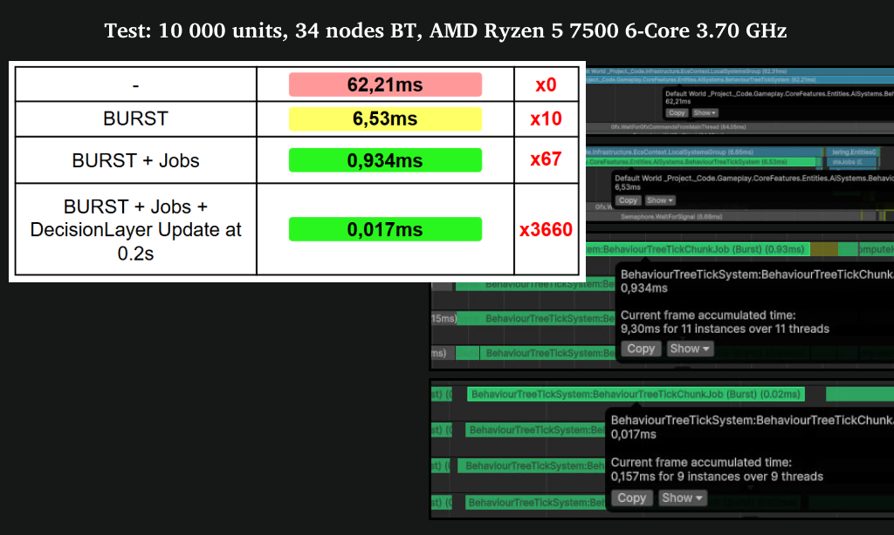

### Кодогенерация

Кодогенерация в проекте появилась не как дополнительное удобство, а как ответ на ограничения `Burst`-ориентированного `runtime`.

При интеграции новой игровой логики в `Behaviour Tree` быстро возникает типичная проблема: привычные для объектной архитектуры инструменты — обобщённые абстракции, интерфейсный `polymorphism`, “универсальные” точки расширения — либо плохо ложатся на `Burst-friendly execution model`, либо превращают hot path в неудобный для оптимизации слой. В результате подключение нового leaf-узла без дополнительной автоматизации начинает вырождаться в повторяющуюся ручную процедуру: данные нужно описывать отдельно, runtime-методы — связывать вручную, а интеграционный код — поддерживать в согласованном состоянии по мере роста числа листьев.

Именно поэтому в проекте используется кодогенерация: она убирает рутинный слой между авторским описанием leaf-логики и runtime-интеграцией BT.

🛠️ **Как выглядит расширение BT для разработчика:**

При добавлении нового leaf-узла разработчик работает в привычной и достаточно прямолинейной форме:

- создаёт новый leaf;
- помечает его `ILeaf`, чтобы он был доступен для выбора в редакторе;
- описывает его runtime-представление данных;
- реализует явную lifecycle-логику:
  - `Tick`
  - `Enter`
  - `Exit`
  - `Abort`
- помечает leaf атрибутом `[LeafCodeGen(ID)]`.

После этого дальнейшая интеграция не требует ручной сборки `glue`-кода.

⚡ **Что делает кодогенерация:**

На этапе генерации система через `reflection` находит все листья, помеченные `LeafCodeGen`, и автоматически создаёт необходимые интеграционные файлы с промежуточным кодом, который встраивает leaf в `BT execution pipeline`.

В итоге кодогенерация выступает как мост между двумя мирами:

- для разработчика leaf остаётся обычной расширяемой единицей игровой логики;
- для runtime он превращается в строго подготовленный и автоматически встроенный элемент `BT execution pipeline`.

### Дебаг и отладка

Для сложной AI-логики наличие удобного дебага является не дополнительным преимуществом, а обязательной частью системы.
Чем больше дерево, чем больше в нём ветвлений, условий и abort-сценариев, тем быстрее оно превращается в труднообслуживаемый `black box`, если его состояние нельзя наблюдать на `runtime`.

В данной реализации BT это учтено как отдельное требование.
Дерево можно использовать не только как `authoring`-инструмент, но и как средство визуальной диагностики поведения: в `debug`-режиме видно, какие ноды сейчас активны, в каком состоянии находится каждая из них и на каком участке дерево ушло не по ожидаемому пути.

🔍 **Это даёт практический выигрыш сразу в нескольких сценариях:**

- быстрое понимание текущего хода принятия решения;
- поиск неверно настроенных веток и условий;
- выявление узлов, в которых дерево застревает;
- отслеживание момента, в котором `execution flow` свернул не туда.

За счёт этого BT остаётся не только исполняемой системой, но и наблюдаемой `runtime`-моделью, с которой можно уверенно работать по мере роста сложности AI.

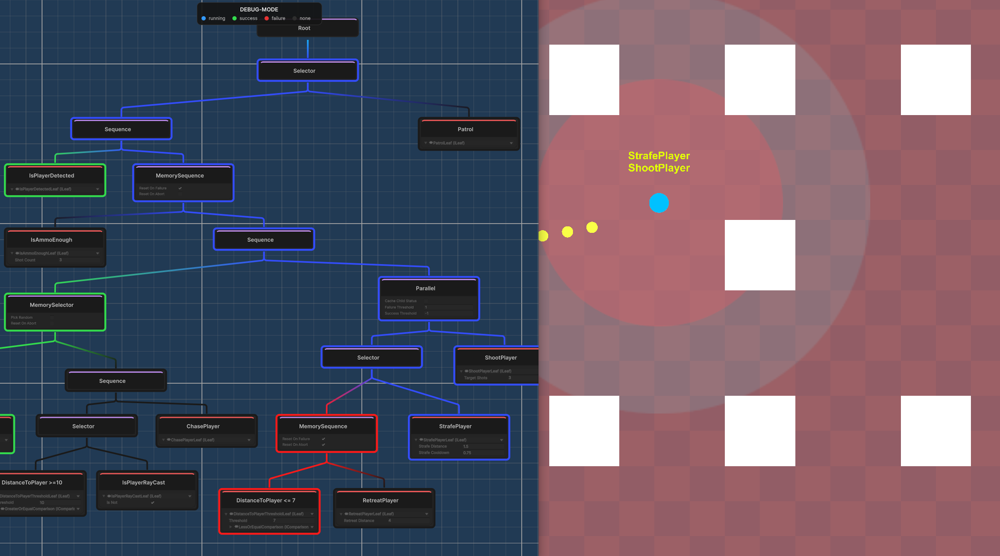

---

## Custom VAT animation pipeline

### Зачем VAT используется в этом проекте

Для массового `battle-simulator` сценария классическая CPU-реализация анимации очень быстро становится узким местом.
Когда количество юнитов измеряется тысячами, а тем более выходит за пределы 10k+, стоимость покадрового обновления `skeletal animation` на CPU начинает расти слишком агрессивно: процессор тратит ресурсы не на игровую логику и принятие решений, а на обслуживание анимационного воспроизведения.

Для такого класса задач это становится архитектурной проблемой, а не локальной точкой оптимизации.
Если проект изначально строится вокруг `DOTS`, `ECS` и массового исполнения, то анимация тоже должна подчиняться той же логике масштабирования.

Именно поэтому в проекте используется `Vertex Animation Texture`.
VAT позволяет вынести воспроизведение анимации на `GPU`, оставив на `CPU` только управление состоянием: выбор клипа, время, переходы и blending. В результате наиболее тяжёлая часть — деформация вершин — перестаёт конкурировать с `AI`, `movement`, `targeting` и остальной gameplay-логикой за CPU-время.

🚀 **Такой подход особенно хорошо ложится на `DOTS`-архитектуру, потому что:**

- CPU управляет только компактным `animation state`;
- сами анимации воспроизводятся на `GPU`;
- одна и та же модель хорошо масштабируется на большие массивы однотипных юнитов;
- animation pipeline становится естественным продолжением `data-oriented runtime`, а не отдельной `CPU-heavy` подсистемой.

Иными словами, VAT здесь используется не как экзотическая графическая техника, а как необходимое архитектурное решение для массовой анимации, без которого проект такого типа быстро упирался бы в потолок CPU-производительности.

### Почему собственная реализация здесь оправдана

Собственная VAT-реализация в проекте оправдана не желанием заменить готовые решения “из принципа”, а набором достаточно жёстких требований, которые в одной системе редко встречаются одновременно. Здесь нужен не просто шейдер, который умеет проигрывать `vertex animation`, а **полный `pipeline`**, который без трения встраивается в `DOTS` / `ECS`-архитектуру, поддерживает массовое воспроизведение, хранит клипы в общей библиотеке, умеет делать `runtime-blend` и остаётся пригодным для реального `production workflow`. Именно такая комбинация требований и делает собственную реализацию рациональным выбором.

- Одно из ключевых требований — **совместимость с `DOTS rendering flow`**, а не просто работа “на обычном `Renderer`”. В проекте это решено через связку `VATRendererUserValue` с `MaterialProperty("unity_RendererUserValuesPropertyEntry")`, GPU `StructuredBuffer` с состояниями анимации и чтение этого состояния в шейдере через `unity_RendererUserValue`. На стороне ECS `VATAnimationUploadSystem` собирает per-entity `animation state`, загружает его в `GraphicsBuffer`, а затем шейдер получает доступ к нужной записи по индексу конкретного инстанса. Это как раз тот слой интеграции, которого обычно не хватает у более общих VAT-решений.

- Второе важное требование — **хранение всех анимаций в общей библиотеке**, а не в разрозненных наборах данных на каждый prefab или каждый клип. В текущей реализации baker собирает общие `position` и `normal` текстуры, а отдельная `metadata` texture хранит для каждого клипа его `rowStart`, `frameCount`, `length` и `meshIndex`. За счёт этого в одной библиотеке можно держать сразу несколько meshes и весь набор их клипов, а runtime выбирает нужный диапазон строк по `clip metadata`, не требуя отдельного шейдера или отдельного `texture set` на каждую анимацию.

- Третье обязательное требование — **runtime blending между клипами**, а не только жёсткое переключение. В проекте это реализовано сквозным образом: `VATAnimationSystem` хранит `CurrentClipIndex`, `PreviousClipIndex`, нормализованное время и `Blend01`; `VATAnimationUploadSystem` отправляет эти данные на `GPU`; `VATCommon.hlsl` семплирует текущий и предыдущий клип и делает `lerp` по `blend factor` как для позиции, так и для нормали. В итоге переход между состояниями анимации остаётся частью полноценного runtime, а не превращается в визуальный скачок.

- Отдельно важна не только совместимость с `DOTS` как таковая, но и **корректность shader pipeline для `Entities Graphics` / instanced rendering**. В шейдерах используются `SV_VertexID` для адресации вершины внутри VAT-текстур, а VAT-сэмплинг вызывается не только в основном vertex pass, но и в `shadow` / `depth` / `depth-normals` проходах. Это критично для `production use`: если анимация есть только в основном pass, а тени и depth остаются в bind-pose, решение перестаёт быть пригодным для реального рендера. Здесь этот вопрос закрыт на уровне самой шейдерной реализации.

- Ещё одно сильное требование — **полноценный `authoring/runtime bridge`**, а не отдельный шейдер без удобного способа довести данные до ECS entity. `VATAnimatorAuthoring` на этапе baking/conversion определяет mesh, сопоставляет его с `meshIndex` в библиотеке, собирает blob с runtime clip data, добавляет `VATLibraryBlobRef`, `VATAnimator`, `VATAnimationCommand`, `VATRendererUserValue` и debug-компонент. То есть решение закрывает не только “как проиграть VAT на GPU”, но и “как сделать так, чтобы объект в сцене естественно превратился в ECS-runtime с нужной библиотекой и корректным `initial state`”.

- Наконец, собственная реализация оправдана тем, что здесь нужен не *isolated shader trick*, а **цельная архитектурная подсистема**: baker создаёт `EXR`-текстуры и настраивает импорт под линейные, `point-sampled`, `uncompressed` данные; библиотека может автоматически применяться к материалу; runtime держит shared blob-данные по клипам и per-entity `animation state`; GPU buffer переиспользуется и масштабируется по `capacity`; fallback global buffer защищает шейдер от отсутствия runtime-данных. В сумме это уже не “кастомный шейдер”, а законченный VAT pipeline, специально подстроенный под архитектуру проекта.

Если сжать это до одной формулировки, то собственная VAT-реализация здесь оправдана потому, что проекту нужен был **DOTS-совместимый, библиотечно-ориентированный, blend-capable, ECS-интегрированный и `production-usable pipeline` массовой анимации**, а не только сам факт воспроизведения вершин на GPU.

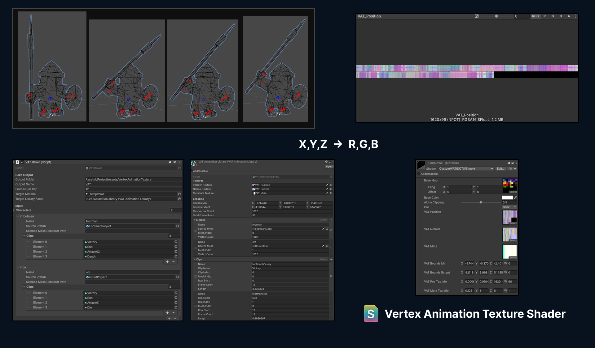

---

## Дополнительные стратегические решения

### Battlefield Grid

В основе боевого пространства проекта лежит `Battlefield Grid` — дискретная сетка поля боя, которая заменяет классический подход на базе физики, коллайдеров и непрерывного позиционирования.
Это решение принято осознанно: для массового `battle-simulator` сценария физическая модель с большим количеством динамических объектов быстро начинает создавать лишнюю стоимость, сложность синхронизации и плохо контролируемое поведение при плотных построениях.

Вместо этого перемещение, размещение и построение юнитов опираются на явно заданную сеточную модель, которая настраивается геймдизайнером для каждой конкретной карты.
Иными словами, поле боя здесь рассматривается не как абстрактное физическое пространство, а как контролируемая структура тактических позиций, в которой каждая клетка имеет конкретный смысл для gameplay.

✅ **Отказ от физики в пользу сетки даёт проекту несколько важных преимуществ:**
- исчезает необходимость решать массовые коллизии через физический движок;
- поведение юнитов становится предсказуемым и управляемым;
- упрощается построение формаций;
- снижается стоимость массового перемещения;
- логика занятости позиций становится явной, а не выводится косвенно через столкновения.

Для `battle simulator` это особенно важно, потому что задача здесь состоит не в реалистичном физическом взаимодействии каждого бойца с каждым бойцом, а в стабильном и масштабируемом управлении большими группами юнитов.

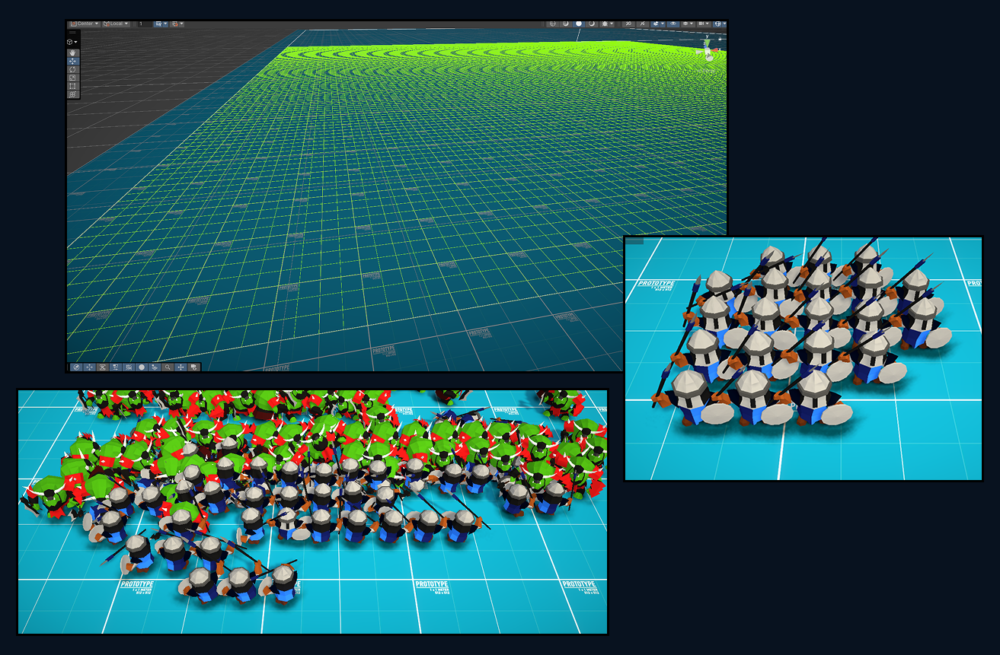

### Eye Sensor Grid

Для поиска ближайшего врага в проекте используется не полный перебор всех юнитов, а отдельный пространственный индекс. `EyeSensorGridSystem` каждый апдейт раскладывает сущности по сетке на плоскости `XZ`, вычисляя бакет как `floor(position / CellSize)`, и хранит их в двух `NativeParallelMultiHashMap<int2, Entity>` — отдельно по каждой команде. Это сразу убирает наивный глобальный поиск и позволяет работать только с локально релевантными ячейками.

Поверх этого индекса `EyeSensorSystem` ищет цель не по всей карте, а кольцами вокруг текущей клетки. Поиск идёт только по `grid` вражеской команды, а каждая ячейка дополнительно отсекается по минимально возможной дистанции до неё: если бакет уже не может дать цель ближе найденной, он пропускается. За счёт этого система не просто уменьшает область поиска, а ещё и рано завершает обход, когда лучший кандидат уже найден.

Дополнительно поиск не пересчитывается каждый кадр без необходимости. Если текущая цель остаётся валидной, система продолжает сопровождать её; полный пересчёт запускается только по `ScanInterval`, по `UpdateNearestInterval` или при потере цели. В результате `EyeSensor` хранит компактное состояние сенсора — найдена ли цель, какая именно и когда нужно обновить поиск — а вся система в целом даёт дешёвый и масштабируемый `nearest-enemy query`, хорошо подходящий для массового `ECS runtime`.

### Единое окно геймдизайнера

Значительная часть настройки проекта построена вокруг `ScriptableObject`-конфигов.
Именно через них задаются параметры, влияющие на игровые системы, баланс, контентные настройки и поведение отдельных подсистем. Такой подход удобен сам по себе, потому что выносит данные из кода в отдельный редактируемый слой, но при росте числа конфигов быстро появляется другая проблема: рабочий процесс начинает расползаться по папкам, а управление игрой превращается в поиск нужных `asset`’ов по структуре проекта.

Чтобы убрать эту фрагментацию, в проекте реализовано единое окно геймдизайнера, собранное на базе `Odin Inspector`.
Оно выступает как централизованная точка доступа ко всем ключевым `ScriptableObject`-конфигам и позволяет работать с настройками игры из одного места, не переключаясь между директориями и не разыскивая нужные `assets` вручную.

🧩 **Такой подход даёт несколько практических преимуществ:**

- все основные конфиги собраны в одном интерфейсе;
- редактирование данных становится быстрее и предсказуемее;
- снижается зависимость от структуры папок и ручной навигации по проекту;
- упрощается сопровождение большого числа настроек;
- повышается удобство работы с игрой как с системой, а не как с набором разрозненных `asset`’ов.

По сути, это окно превращает `ScriptableObject`-архитектуру в более зрелый `production`-инструмент:
данные остаются разложенными по отдельным `asset`’ам, но доступ к ним организован через единый управленческий слой, удобный для повседневной работы геймдизайнера.

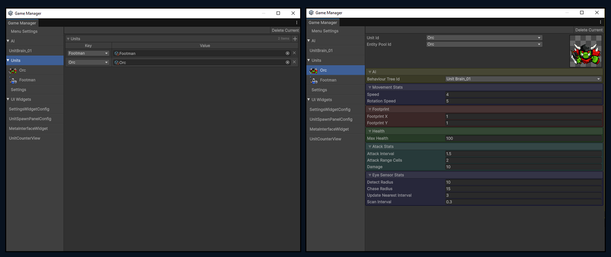

### Подход к реализации UI в проекте

UI в проекте поднимается отдельно для каждого игрового состояния и собирается через конфиги, а не жёстко зашивается в сцену. Это позволяет на уровне настройки определять, какой именно интерфейс нужен в конкретном режиме и как он должен быть сконфигурирован. Например, один и тот же `UI`-модуль может переиспользоваться в разных состояниях с разным набором отображаемых данных.

При этом UI не привязан к gameplay-сценам. Вёрстка и настройка интерфейса вынесены в отдельную `editor`-сцену, а в `runtime` поднимается только тот UI, который нужен текущему состоянию. Такой подход принципиально снижает сцепление между сценами и интерфейсом, упрощает переиспользование экранов и делает UI частью `state-driven` архитектуры, а не частью конкретного `level setup`.

Управление всем интерфейсом централизовано в `WidgetService`, который берёт на себя показ, скрытие и переключение виджетов. Внутренняя архитектура UI построена в стиле `MVP Presentation-Model`, близком по идеологии к MVVM: логика и состояние представления вынесены из вёрстки, а сами виджеты остаются тонким слоем отображения. Это делает UI более управляемым, расширяемым и удобным в сопровождении.

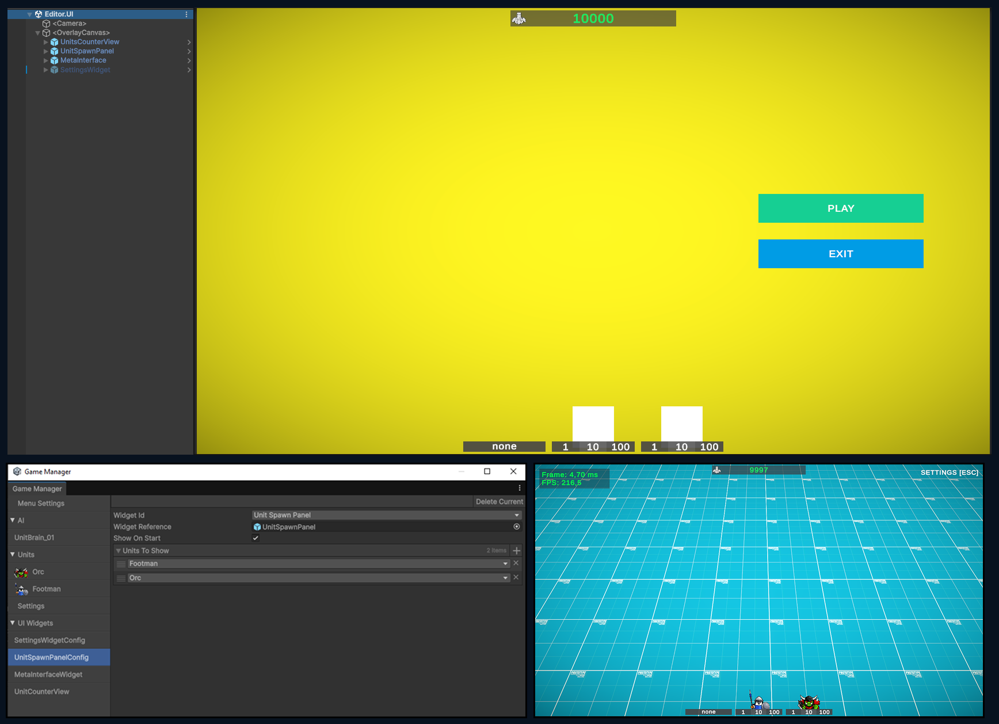

### Модуль сохранений

В проекте сохранения оформлены не как разрозненные вызовы `PlayerPrefs` или прямой записи файлов из разных мест кода, а как отдельный `repository-layer`, который централизует всю работу с `persistent data`.

В основе лежит собственный `SaveRepository`, через который игровые данные сохраняются и загружаются как единый слой приложения. Такой подход важен архитектурно: код игровых систем не должен знать, куда именно и каким способом записываются данные. Его задача — работать с моделью сохранения, а не с файловой системой или конкретным API платформы.

За фактическую запись отвечает `strategy`-слой. В проекте основным `persistent`-каналом выступает сохранение в `AppData`, где данные записываются в `binary`-файл. Это даёт более надёжную и контролируемую форму хранения, чем разрозненные `key-value` записи, и лучше подходит для дальнейшего роста объёма данных и усложнения структуры сохранений.

💾 **Практический выигрыш такого подхода:**

- логика сохранения отделена от игровой логики;
- формат хранения инкапсулирован в отдельном слое;
- систему проще расширять и менять без переписывания gameplay-кода;
- сохранения централизованы и не размазаны по проекту;
- работа с `persistent data` становится частью общей архитектуры, а не набором локальных технических решений.

Иными словами, в проекте сохранения реализованы как самостоятельная инфраструктурная подсистема: данные проходят через `repository`, а затем сериализуются и сохраняются в `AppData` в бинарном виде, что делает этот слой заметно более зрелым и поддерживаемым, чем прямые `ad-hoc` вызовы сохранения из отдельных игровых модулей.

---

## Запуск проекта

Для запуска используется сцена:

`Assets/_Project/Scenes/0.Bootstrap`

🎮 **Управление:**
- Перемещение камеры — `edge scroll` при подводе курсора к краям экрана.
- Зум камеры — колёсико мыши.
- Выделение юнитов — `drag selection` левой кнопкой мыши.
- Команда перемещения выбранным юнитам — правая кнопка мыши по точке на земле.

